# 🚀 Varnan App - Full-Stack Social Media Application

Varnan App is a modern React Native (Expo) application designed to simplify visual storytelling through intuitive image management, context sharing, and seamless Supabase integration.

It combines the power of Supabase, React Context API, and modular UI components to create a fluid and responsive mobile experience.

## 🚀Screeshots

  <!-- Thumbnail -->
  <h3 align="center">App Overview</h3>
  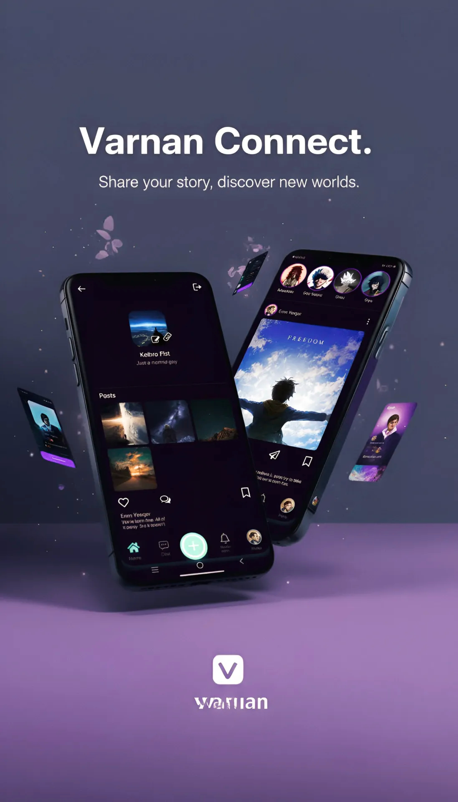

    

  <!-- Row 1 -->
  <h4 align="center">Welcome Screen &nbsp;&nbsp;|&nbsp;&nbsp; Login Screen &nbsp;&nbsp;|&nbsp;&nbsp; Signup Screen</h4>
  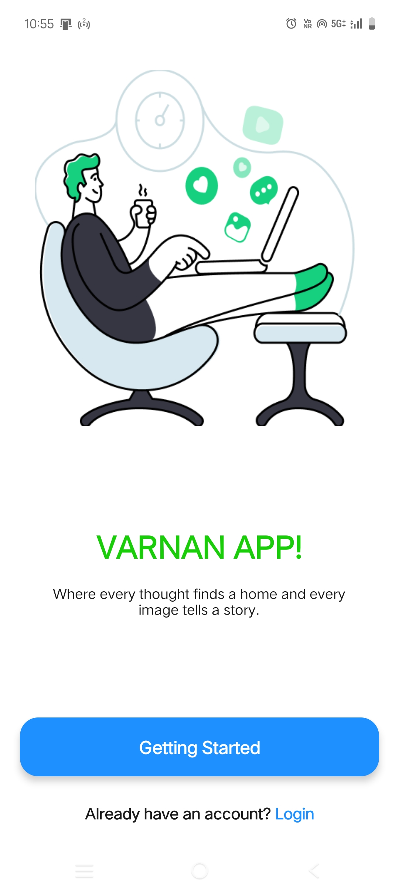
  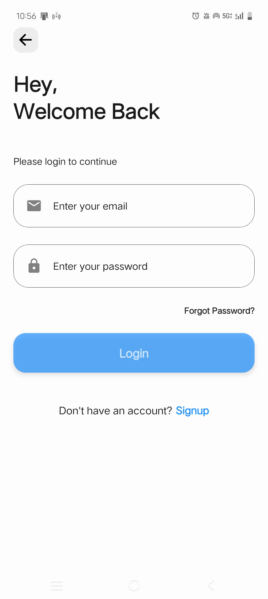
  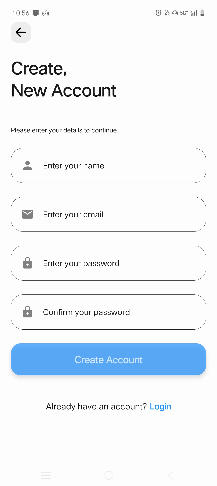

    

  <!-- Row 2 -->
  <h4 align="center">Home Screen &nbsp;&nbsp;|&nbsp;&nbsp; Chat Screen &nbsp;&nbsp;|&nbsp;&nbsp; Notification Screen</h4>
  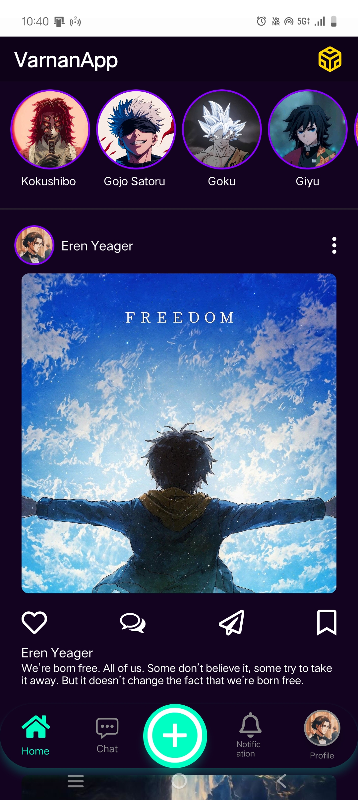
  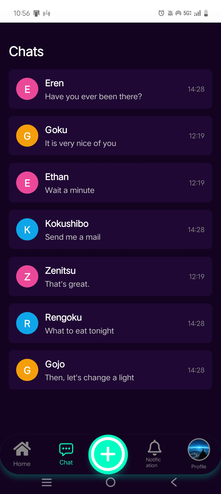
  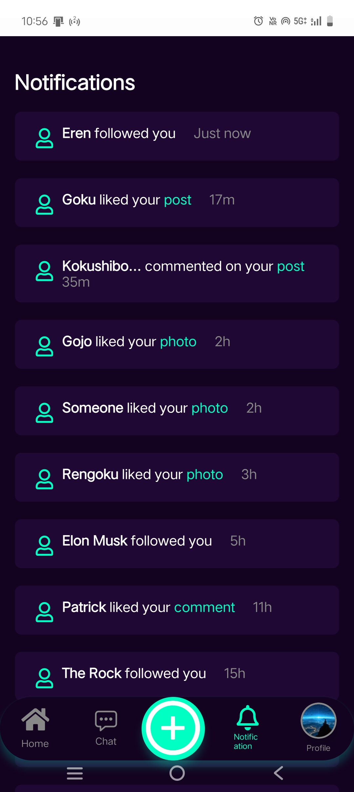

    

  <!-- Row 3 -->
  <h4 align="center">Profile Page &nbsp;&nbsp;|&nbsp;&nbsp; Edit Profile Page &nbsp;&nbsp;|&nbsp;&nbsp; Create Post Page</h4>
  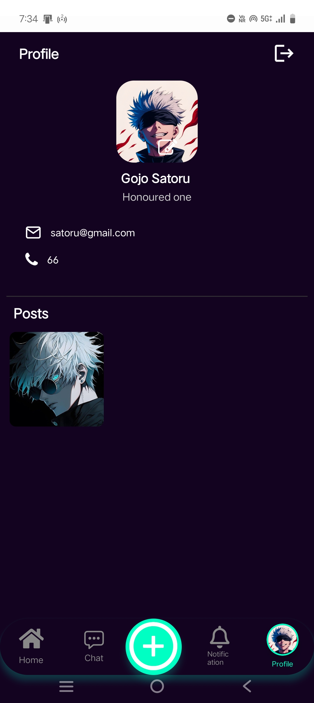
  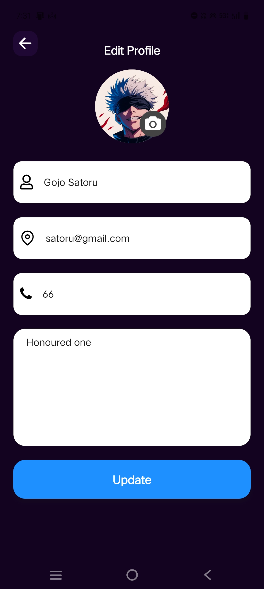
  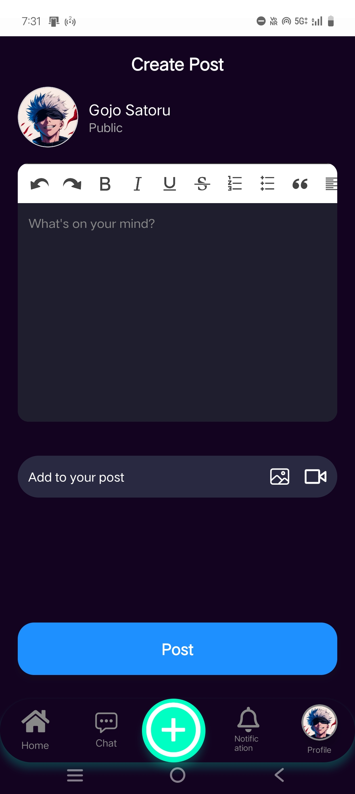

    
  
  <!-- Row 4 -->
  <h4 align="center">Developer</h4>
  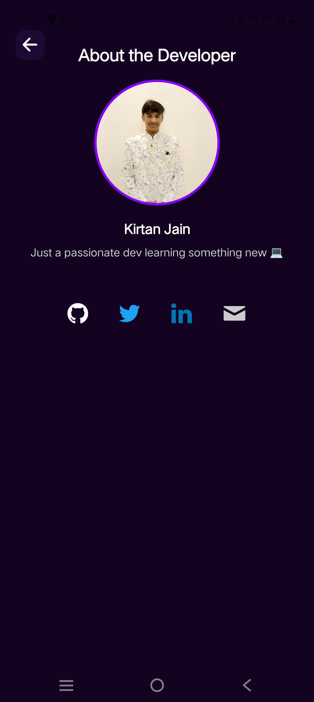

## 🚀 Features

🧑‍💼 User Authentication — Sign up, sign in, and session management with Supabase Auth.

🖼️ Image Uploads & Storage — Secure uploads handled through Supabase Storage.

📝 Posts System — Authenticated users can create, view, and manage posts.

🔒 Row-Level Security (RLS) — Protects user data and ensures access control.

⚛️ Context API — Centralized state management for images and user data.

💾 Local File Management — Smooth file handling via expo-file-system.

🧩 Custom Components —

ScreenWrapper – Safe area wrapper

Icons – Centralized icon mapping

ImageContext – Manages selected images and image list

🎨 Minimal Modern UI — Optimized for both iOS and Android.

⚡ Expo-Powered — Simple builds, fast testing, and device previews.

## 🧰 Tech Stack

React Native (Expo)

Supabase (Auth, Database, Storage)

Context API

React Navigation

Expo FileSystem

@expo/vector-icons

## ⚙️ Installation & Setup

 1️⃣ Clone the repository
git clone https://github.com//varnan-app.git

 2️⃣ Navigate into the project folder
cd varnan-app

 3️⃣ Install dependencies
npm install

 4️⃣ Start the Expo development server
npx expo start

Then scan the QR code with your Expo Go app or run it on an emulator.

## 🔧 Supabase Configuration

1. Create a Supabase Project

Head over to https://supabase.com and create a new project.
Once ready, go to Project Settings → API and grab:

Project URL

Anon Key

2. Add Environment Variables

In your project root, create a .env file:

EXPO_PUBLIC_SUPABASE_URL=https://your-project.supabase.co
EXPO_PUBLIC_SUPABASE_ANON_KEY=your-anon-key

## 🧮 Supabase Database Setup

1️⃣ Users Table (optional if using default auth.users)

Supabase automatically creates an auth.users table when you enable authentication.
Each user who signs up will be stored there.

If you need a custom users table (for profile data, display name, etc.), run:

create table public.profiles (
  id uuid references auth.users on delete cascade not null primary key,
  username text,
  avatar_url text,
  created_at timestamp with time zone default timezone('utc'::text, now()) not null
);

Enable RLS:

alter table public.profiles enable row level security;

Add policies:

create policy "Users can view their own profile" 
on public.profiles for select 
using (auth.uid() = id);

create policy "Users can update their own profile" 
on public.profiles for update 
using (auth.uid() = id);

2️⃣ Posts Table

Each post will belong to a user.

create table public.posts (
  id uuid default uuid_generate_v4() primary key,
  user_id uuid references auth.users(id) on delete cascade,
  title text,
  image_url text,
  created_at timestamp with time zone default timezone('utc'::text, now()) not null
);

Enable RLS:

alter table public.posts enable row level security;

Add policies:

-- Only logged-in users can insert
create policy "Users can insert their own posts" 
on public.posts for insert 
with check (auth.uid() = user_id);

-- Users can view all posts
create policy "Users can read all posts" 
on public.posts for select 
using (true);

-- Users can update only their own posts
create policy "Users can update their own posts" 
on public.posts for update 
using (auth.uid() = user_id);

-- Users can delete only their own posts
create policy "Users can delete their own posts" 
on public.posts for delete 
using (auth.uid() = user_id);

3️⃣ Storage Setup

1. Go to Storage → Create Bucket
Name it: uploads
Set Public Access to Off (recommended).

2. Add storage policy (SQL editor):

create policy "Allow users to manage their own files"
on storage.objects for all
using (auth.uid() = owner)
with check (auth.uid() = owner);

3. You’re now ready to handle uploads through the app using the helper in helpers/storage.js.

## 🧩 Key Components

🖼️ ImageContext

Holds and provides:

selectedImage

imageList

Setter functions to update them across components.

🧱 ScreenWrapper

Provides safe area padding and consistent screen background color.

🧰 storage.js

Utility functions for file upload and handling via Supabase and expo-file-system.

## 🧑‍💻 Contributing

Pull requests are welcome!
For major changes, please open an issue first to discuss your ideas.

## ⚠️ License

This project has No License.
All rights reserved — copying, modification, or redistribution is not permitted without explicit permission from the author.

## 🌟 Acknowledgments

Expo

Supabase

React Native

Vector Icons

